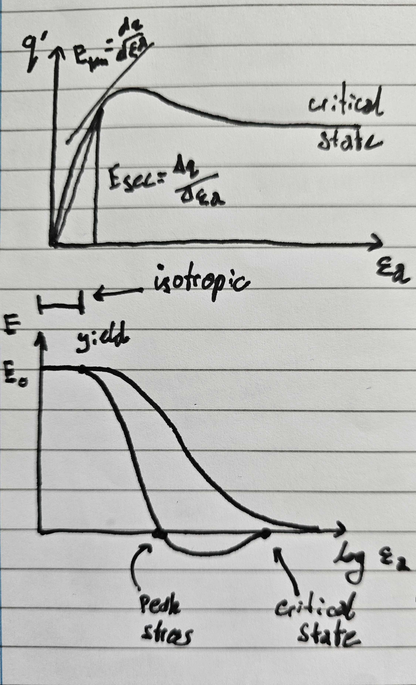
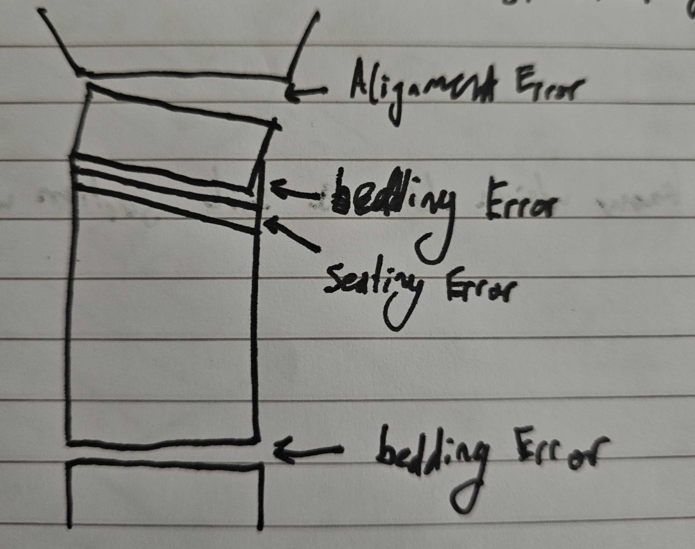
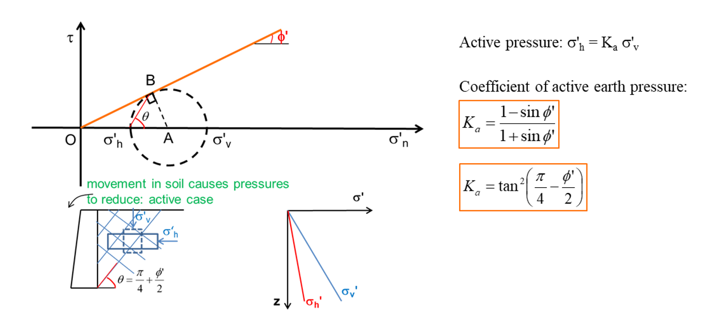
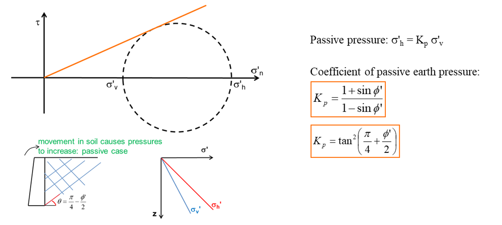
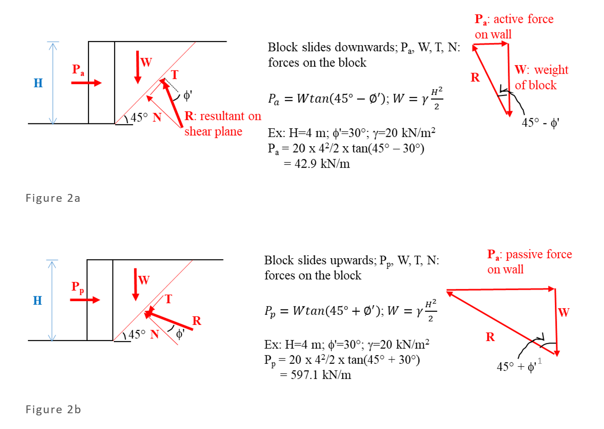

# Navier Stokes
## Reynold's number for pipe
$R_e=\frac{\rho VD}{\mu}$ or $R_e=\frac{VD}{\upsilon}$
## Numbers to remember
$R_e>1400\leftarrow$ turbulent flow

kinematic viscosity $\upsilon$ of water = $1*10^{-6}$ PaS
# Open Channel Flow
## Hydraulic Radius
$R_h=\frac{A}{P}$

$A=$ Area

$P=$ Wetted Perimeter
## Reynold's Number for OCF
$R_e=\frac{\rho VR_h^2}{\mu}$
## Flow Area
$q=\frac{Q}{z}=y\overline{U}$
## Froude Number
$F_r=\frac{\overline{U}^2}{gy}$
## Specific Energy
$E=y+\frac{q^2}{2gy^2}$
## Sluice Gate
$y_1v_1=y_2v_2$

(flow in = flow out)
## Hydraulic Jump
$E1=E2+\delta z$
# Soil Tests
## Triaxial Test
### Secant Stiffness
The ratio of $\frac{q}{\epsilon_a}$
### Tangent Stiffness
The tangent of the line plotting $q'$ by $\epsilon_a$ at a given point
### Soil States

### Sources of Error

## Shear Box Test
## Problems
The sheer box test only fails a sample in one plane. This is an unrealistic case as in reality soil fails on whichever plane fails first in loading.
# Soil Mechanisms

# Retaining Walls
## Rankine's Principle
### Assumptions
- wall is smooth
- force from earth pressure is parrallel to the ground surface
### Method
Soil will fail when the Mohr's circle (circle drawn between effective vertical and horizontal strain) of effective stresses touches the failure envelope (line drawn at $\phi$)

## Coulomb's Method
### Assumptions
- failure occurs across two planes (soil wall interface and failure plane)
- wedge behaves like a rigid block
- colomb's friction law ($\tau=\sigma _n'tan\phi$)
- angle of friction in mobilised ground is $\phi$
- angle of friction in soil wall interface is $\delta$
## Active and Passive forces
